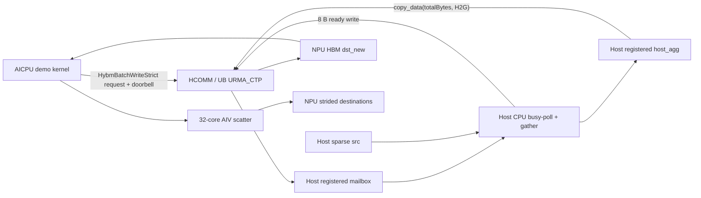
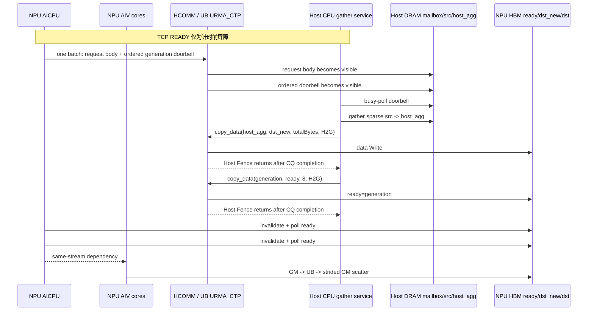

# AICPU 发起 Host 聚合、URMA_CTP 大包写与 AIV Scatter Demo

> 本文只描述性能穿刺 Demo。固定两 rank、单请求、等长分段、busy-poll；不实现数据校验、
> 超时、重试、并发、ring、流控、回收协议或异常清理。传输固定使用 UB `URMA_CTP`，不走 RoCE。

## 1. 审阅结论与修正

原方案需要做七处收敛：

1. 原时序由“NPU 侧 Host 进程通过 TCP 发 `RUN/WRITE_DONE`”驱动，不能测到 AICPU 发起控制请求的
   真实端到端时延。新 Demo 中 TCP 只做计时前启动屏障；AICPU 通过 URMA 单边写 Host mailbox 发起请求。
2. 该控制面是“单边 Write 实现消息协议”，不是 URMA 双边 Send/Recv。当前 HCOMM 公共 `Channel`
   没有 Send/Recv，没必要为了 Demo 扩展整套接收队列。
3. Host UBC_CTP 的 `NotifyRecord`、`NotifyWait`、`WriteWithNotify` 均返回不支持，不能用
   write-with-notify 唤醒 Host。源码位置：
   `C:/code/cann/hcomm/src/base_comm/resources/endpoint_pairs/channels/host/host_cpu_urma_channel.cc:208-223`。
4. Host 原来只检查 Device HBM key 而不 import，无法反向写 `dst_new`。现在 Host 对 Device HBM 调用
   既有 `HcommMemImport`，保存“发布 GVA → imported view”映射：
   [`host_urma_transport_manager.cpp`](../src/hybm/csrc/transport/host/host_urma_transport_manager.cpp#L488-L604)。
5. 当前 HCOMM UBC_CTP `MemoryImport` 只回填 `addr/size`，不回填 `type`：
   `C:/code/cann/hcomm/src/base_comm/resources/reged_mems/urma_mem.cc:126-161`。MF 在 type 未设置时按本地
   endpoint 和导出描述恢复 view type；transfer flag 只使用 import 返回的地址和长度。实现见
   [`hcomm_transport_manager.cpp`](../src/hybm/csrc/transport/urma/hcomm_transport_manager.cpp#L376-L419)。
6. 独立 AICPU 构建会覆盖 kernel 源列表，因此必须同时把 Demo 加入
   [`src/hybm/ops/CMakeLists.txt`](../src/hybm/ops/CMakeLists.txt) 和
   [`build_ops_run.sh`](../script/kernel/build_ops_run.sh)，否则 JSON 中有算子名但 `.so` 中没有实现。
7. AICPU 只负责 request 和 ready 轮询；同一 stream 上排在其后的 32 核 AIV kernel 通过 UB 完成
   `dst_new` 到离散目的地址的 scatter。

最终路径为：

```text
AICPU 一次 batch 写 Host request + generation doorbell
  -> Host CPU 观察 doorbell
  -> Host CPU 整轮 gather
  -> 一次同步 copy_data(H2G) 到 dst_new
  -> Host 写同一 generation 到 NPU ready
  -> 32 核 AIV scatter
```

## 2. 目标与固定条件

目标只有两个：

- 证明 AICPU 可以主动触发 Host CPU 聚合，并完成反向 ready 通知。
- 测量从 AICPU 发请求到 AIV scatter 完成的 Host launcher 端到端耗时。

固定条件：

- rank 0 是 Host DRAM，rank 1 是 NPU HBM。
- 一次只运行一个请求；第 N 轮 doorbell 和 ready 使用 generation `N + 1`。
- 所有段等长；默认 `4096 × 2048 B = 8 MiB`。
- Host 源和 NPU 目的均使用 `2 × segmentBytes` stride，体现离散 gather/scatter。
- Host/NPU pool 在 `join()` 时一次分配和注册。
- API 返回非零时由 Python `assert` 直接退出，不做任何恢复。

## 3. 复用的真实路径

### 3.1 AICPU → Host 请求

新增 AICPU 测试算子 `HybmAggregateUrmaDemo`，但不新增 HCOMM API。它从现有
`BatchCopyRouteTable` 取得 AICPU thread、channel 和 Host MR imported view，然后一次调用
`HybmBatchWriteStrict`，其中包含两个有序 descriptor：

1. 64 B request body；
2. 8 B generation doorbell。

实现见
[`hybm_aggregate_urma_demo.cc`](../src/acc_offload/csrc/operators/aicpu/hybm_aggregate_urma_demo.cc#L55-L135)。
`HybmBatchWriteStrict` 复用现有 batch 提交和 `HcommChannelFenceOnThread`：
[`hybm_batch_transfer.cc`](../src/hybm/ops/hybm_kernel/hybm_batch_transfer.cc#L191-L253)。

A5 的 batch transfer 将最后一个 descriptor（doorbell）设置为 strong placement order 和 completion order，
因此 request body 先于 doorbell 对 Host 可见。调用返回仍只是提交/排序点，不是远端完成；Host 观察到
当前 generation 的 doorbell 才表示本轮请求已到达。该 Demo 要求 `HcommBatchTransferOnThread` 可用，
不再保留两次单写的兼容路径；不支持 batch 时直接返回错误。

### 3.2 Host gather

Host 使用 Python 扩展中的一个 Demo-only C++ helper：

```cpp
aggregate_wait_demo(mailbox, expectedDoorbell)
aggregate_gather_range_demo(source, aggregate, srcStride, segmentCount, segmentBytes, gatherThreads)
```

前者 busy-poll 当前 generation 的 doorbell；后者按 request 中的 `segmentCount`、`segmentBytes` 和
`srcStride` 循环 memcpy 到连续 `host_agg`。整轮 gather 完成后再提交一次大包写。实现见
[`pymf_acc_offload.cpp`](../src/acc_offload/csrc/python_wrapper/pymf_acc_offload.cpp#L27-L54)。

这样 gather 数据不包含 Python 逐段循环开销。

### 3.3 Host → NPU 数据和 ready

Host 使用同步 `BigMemory.copy_data(..., H2G)`：

1. 执行一次 `host_agg -> dst_new`，长度为 `totalBytes`；
2. 数据写完成后，将 Host mailbox 中的 generation 写入 NPU ready，长度为 8 B。

Demo 调用位置见
[`03_aicpu_host_aggregate_urma.py`](../examples/kv_offload/sparse_copy_urma/03_aicpu_host_aggregate_urma.py#L115-L143)。
Host 同步写最终进入 `WriteRemote`，提交 `HcommWriteOnThread` 后执行 Channel Fence：
[`host_urma_transport_manager.cpp`](../src/hybm/csrc/transport/host/host_urma_transport_manager.cpp#L792-L926)。
Host UBC_CTP Fence 会轮询 JFC，直到本批 WQE 完成：
`C:/code/cann/hcomm/src/base_comm/resources/endpoint_pairs/channels/host/host_cpu_urma_channel.cc:350-392`。

所以顺序是：

```text
dst_new 整批写完成并 Fence 返回
  < ready 写提交
  < ready Fence 返回
  < AICPU 观察到 ready
```

不使用 `HcommWriteWithNotify*`，也不把 API 提交返回当作完成。

### 3.4 AIV local scatter

AICPU 对 ready cache line 执行 cache invalidate 并 busy-poll。观察到当前 generation 后返回；同一 stream
上的 AIV kernel 随后启动。32 个 AIV 按连续 segment 区间分工，每段通过 UB 完成 GM→UB→GM：

```cpp
for (uint32_t i = coreBegin; i < coreEnd; ++i) {
    DataCopyPad(ub, dstNew + i * segmentBytes, segmentBytes);
    DataCopyPad(dstBase + i * dstStride, ub, segmentBytes);
}
```

实现见
[`acc_offload_aggregate_urma_scatter.cpp`](../src/acc_offload/csrc/operators/acc_offload_aggregate_urma_scatter.cpp)。
单段超过 16 KiB 时会继续在段内分块，但 656 B 等小段每段只产生一组 GM→UB→GM。该路径不再执行
AICPU `memcpy` 或逐 cache line clean。

## 4. 架构与时序





## 5. 固定内存布局

两端 pool 大小由参数计算，并向上对齐到 2 MiB。默认参数下约为 26 MiB。

### Host DRAM pool

```text
+0                         : 128 B mailbox
+4 KiB                     : sparse source base
                             source[i] = base + i * (2 * segmentBytes)
align(source end, 4 KiB)   : continuous host_agg[totalBytes]
```

### NPU HBM pool

```text
+0                         : local request message
+4 KiB                     : ready uint64
+8 KiB                     : timing result, 64 B
+12 KiB                    : continuous dst_new[totalBytes]
align(dst_new end, 4 KiB)  : destination base
                             dst[i] = base + i * (2 * segmentBytes)
```

`host_agg` 和 `dst_new` 是两个不同的连续区：前者由 rank 0 分配并注册为 Host DRAM，后者由
rank 1 分配并注册为 Device HBM。Demo 只有一次请求，因此没有复用和释放协议。

## 6. 控制消息

控制结构定义见
[`hybm_aggregate_urma_demo.h`](../src/acc_offload/csrc/operators/aicpu/hybm_aggregate_urma_demo.h#L12-L49)：

```cpp
struct alignas(64) HybmAggregateUrmaDemoRequest {
    uint64_t hostMailboxGva;
    uint64_t dstNewGva;
    uint64_t readyGva;
    uint64_t totalBytes;
    uint64_t srcStride;
    uint64_t dstStride;
    uint32_t segmentCount;
    uint32_t segmentBytes;
    uint64_t reserved;
};

struct alignas(64) HybmAggregateUrmaDemoMessage {
    HybmAggregateUrmaDemoRequest request; // 64 B
    uint64_t doorbell;                    // offset 64
    uint8_t padding[56];
};
```

没有 request ring、状态、错误码或 checksum；单槽 mailbox 通过逐轮递增的 generation 防止重复消费旧通知。

## 7. 调用与完成语义

| 顺序 | 执行实体 | 调用 | 本 Demo 中的含义 |
| ---: | --- | --- | --- |
| 1 | NPU Host launcher | `AccOffloadAggregateUrmaDemo(...)` | 同 stream 提交 AICPU control 和 AIV scatter |
| 2 | AICPU | `HybmBatchWriteStrict(request body + doorbell)` | 一次 batch 提交有序控制消息；返回不是远端完成 |
| 3 | Host CPU | `aggregate_wait_demo(...)` | busy-poll 当前 generation |
| 4 | Host CPU | `aggregate_gather_range_demo(...)` | C++ 完成整轮 gather |
| 5 | Host CPU | `copy_data(host_agg, dstNewGva, totalBytes, H2G, 0)` | 整批同步返回包含 Host Channel Fence |
| 6 | Host CPU | `copy_data(doorbell, readyGva, 8, H2G, 0)` | 数据写完成后发布 ready；同步返回包含 Fence |
| 7 | AICPU | invalidate + poll `ready` | ready 可见后 control kernel 返回 |
| 8 | AIV | 32 核 GM→UB→GM | 将连续 `dst_new` scatter 到固定 stride 目的地址 |
| 9 | NPU Host launcher | `aclrtSynchronizeStream` | AICPU control 和 AIV scatter 全部结束 |

Host 只向 HCOMM 提交一次 `totalBytes` 写。HCOMM 仍可能按 `maxWriteSize` 把它拆成多个物理 URMA WR；实现位于
`C:/code/cann/hcomm/src/base_comm/resources/endpoint_pairs/channels/host/host_cpu_urma_channel.cc:253-340`。

## 8. 时延口径

AICPU 使用同一个 `steady_clock` 记录控制路径：

- `requestNs`：route 查找、一次双 descriptor 控制 batch 和 Fence 设置；不表示 doorbell 已在 Host 可见；
- `waitHostNs`：控制 batch 返回到 ready 可见；Host 可能已并行处理，因此这里只是 Host 路径的剩余时延；
- `scatterNs`：固定为 0；scatter 已移到 AIV；
- `totalNs`：`requestNs + waitHostNs`，即 AICPU control 时长。

Python 以 `launch sync - AICPU control` 输出 `AIV scatter estimate`。该值包含 AIV kernel、两类 kernel
之间的调度以及 launcher 开销，只用于版本间对比；`launch sync` 才是完整端到端指标。

Host 的 `wait_us` 从 Host helper 开始等待计时，不等同于 AICPU→CPU 单向通知时延；它只用于观察
Host 服务线程在屏障后的等待情况。

性能判断使用现有 sparse-copy 示例另测相同段数、段长和 stride 的基线，再比较：

```text
gain = direct_sparse_copy_time - launch_sync_time
```

同时观察 `gather_us` 和 `AIV scatter estimate`。如果 `gain <= 0`，该段数/总字节数组合不启用聚合；不预设
聚合对所有输入都更快。

## 9. 构建与运行

先使用现有 local DRAM 验证开关构建并安装 MemFabric 主包，再单独构建并安装 AICPU kernel：

```bash
bash script/build_and_pack_run.sh --build_local_dram_validation ON
bash script/kernel/build_ops_run.sh
./output/memfabric_hybrid_aicpu_kernel.run --install --force
```

按 `examples/kv_offload/sparse_copy_urma/README.md` 生成同一份 `env`。先启动 Host：

```bash
python3 examples/kv_offload/sparse_copy_urma/03_aicpu_host_aggregate_urma.py \
  --role host --head-ip 127.0.0.1
```

再启动 Device：

```bash
python3 examples/kv_offload/sparse_copy_urma/03_aicpu_host_aggregate_urma.py \
  --role device --head-ip 127.0.0.1
```

修改输入时，两端传入相同参数：

```bash
--segments 8192 --segment-bytes 1024
```

Demo 不检查两端参数是否一致；不一致时直接视为无效测试。

## 10. 实施提交

实现拆为五个可审阅阶段：

1. 补齐 Host/Device UBC_CTP import view，使 Host 可以写 `dst_new/ready`。
2. 新增最小 AICPU request/wait kernel、AIV scatter kernel 和独立构建入口，并使用 `HybmBatchWriteStrict`。
3. 在 `sparse_copy_urma` 下新增单请求 Demo 和运行说明。
4. 去掉 Demo kernel 的显式 runtime timeout，保持纯 happy path。
5. 用本文替换原生产化方案，删除可靠性、校验和并发设计。

## 11. 本 Demo 明确不回答的问题

- 数据内容是否正确；Demo 不做 checksum、回读或 guard 校验。
- 多请求并发、资源复用、背压和释放。
- 超时、重复通知、断链、kernel 失败和进程异常。
- 非等长段、零长度和任意描述符。
- AIV block 数、UB 大小和双缓冲的最终调优。
- 真正 URMA 双边 Send/Recv 的接口设计。

这些内容不属于本次端到端性能穿刺。
