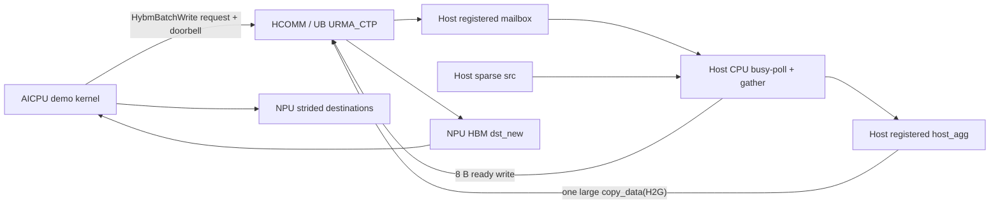

# AICPU 发起 Host 聚合、URMA_CTP 大包写与本地 Scatter Demo

> 本文只描述性能穿刺 Demo。固定两 rank、单请求、等长分段、busy-poll；不实现数据校验、
> 超时、重试、并发、ring、流控、回收协议或异常清理。传输固定使用 UB `URMA_CTP`，不走 RoCE。

## 1. 审阅结论与修正

原方案需要做七处收敛：

1. 原时序由“NPU 侧 Host 进程通过 TCP 发 `RUN/WRITE_DONE`”驱动，不能测到 AICPU 发起控制请求的
   真实端到端时延。新 Demo 中 TCP 只做计时前启动屏障；AICPU 通过 URMA 单边写 Host mailbox 发起请求。
2. 该控制面是“单边 Write 实现消息协议”，不是 URMA 双边 Send/Recv。当前 HCOMM 公共 `Channel`
   没有 Send/Recv，没必要为了 Demo 扩展整套接收队列。
3. Host UBC_CTP 的 `NotifyRecord`、`NotifyWait`、`WriteWithNotify` 均返回不支持，不能用
   write-with-notify 唤醒 Host。源码位置：
   `C:/code/cann/hcomm/src/base_comm/resources/endpoint_pairs/channels/host/host_cpu_urma_channel.cc:208-223`。
4. Host 原来只检查 Device HBM key 而不 import，无法反向写 `dst_new`。现在 Host 对 Device HBM 调用
   既有 `HcommMemImport`，保存“发布 GVA → imported view”映射：
   [`host_urma_transport_manager.cpp`](../src/hybm/csrc/transport/host/host_urma_transport_manager.cpp#L488-L604)。
5. 当前 HCOMM UBC_CTP `MemoryImport` 只回填 `addr/size`，不回填 `type`：
   `C:/code/cann/hcomm/src/base_comm/resources/reged_mems/urma_mem.cc:126-161`。MF 在 type 未设置时按本地
   endpoint 和导出描述恢复 view type；transfer flag 只使用 import 返回的地址和长度。实现见
   [`hcomm_transport_manager.cpp`](../src/hybm/csrc/transport/urma/hcomm_transport_manager.cpp#L376-L419)。
6. 独立 AICPU 构建会覆盖 kernel 源列表，因此必须同时把 Demo 加入
   [`src/hybm/ops/CMakeLists.txt`](../src/hybm/ops/CMakeLists.txt) 和
   [`build_ops_run.sh`](../script/kernel/build_ops_run.sh)，否则 JSON 中有算子名但 `.so` 中没有实现。
7. Host 写入 `dst_new` 后，AICPU 在读取前失效对应 cache line；scatter 后 clean 目的 cache line 并执行
   `dsb`。这两部分都是数据路径的一部分，计入 `scatterNs`。

最终路径为：

```text
AICPU 写 Host request
  -> Host CPU 观察 doorbell
  -> Host CPU gather
  -> Host 一次大包 copy_data(H2G) 到 dst_new
  -> Host 写 NPU ready
  -> AICPU scatter
```

## 2. 目标与固定条件

目标只有两个：

- 证明 AICPU 可以主动触发 Host CPU 聚合，并完成反向 ready 通知。
- 测量从 AICPU 发请求到 AICPU scatter 完成的同一时钟域端到端耗时。

固定条件：

- rank 0 是 Host DRAM，rank 1 是 NPU HBM。
- 一次只运行一个请求，doorbell 和 ready 固定为 `1`。
- 所有段等长；默认 `4096 × 2048 B = 8 MiB`。
- Host 源和 NPU 目的均使用 `2 × segmentBytes` stride，体现离散 gather/scatter。
- Host/NPU pool 在 `join()` 时一次分配和注册。
- API 返回非零时由 Python `assert` 直接退出，不做任何恢复。

## 3. 复用的真实路径

### 3.1 AICPU → Host 请求

新增 AICPU 测试算子 `HybmAggregateUrmaDemo`，但不新增 HCOMM API。它从现有
`BatchCopyRouteTable` 取得 AICPU thread、channel 和 Host MR imported view，然后两次调用
`HybmBatchWrite`：

1. 提交 64 B request body，调用末尾设置 Fence；
2. 提交 8 B doorbell；该 Write 消费上一步 Fence，调用末尾再设置下一次 Fence。

实现见
[`hybm_aggregate_urma_demo.cc`](../src/acc_offload/csrc/operators/aicpu/hybm_aggregate_urma_demo.cc#L55-L135)。
`HybmBatchWrite` 复用现有 batch/single 提交和 `HcommChannelFenceOnThread`：
[`hybm_batch_transfer.cc`](../src/hybm/ops/hybm_kernel/hybm_batch_transfer.cc#L191-L253)。

A5 AICPU 的 `HcommChannelFenceOnThread` 不等待 CQ；它只让下一次操作带 fence、strong order 和 completion
order：`C:/code/cann/hcomm/src/legacy/ascend950/unified_platform/resource/transport/aicpu/`
`ub_transport_lite_impl.cc:1041-1055`。因此第一次调用后的 Fence 用来保证 request body 先于下一次 doorbell
写可见；第二次调用返回仍只是提交/排序点，不是远端完成。Host 观察到 doorbell 才表示请求已到达。

### 3.2 Host gather

Host 使用 Python 扩展中的一个 Demo-only C++ helper：

```cpp
aggregate_wait_and_gather_demo(mailbox, source, aggregate)
```

它 busy-poll doorbell，随后按 request 中的 `segmentCount`、`segmentBytes` 和 `srcStride` 循环
`memcpy` 到连续 `host_agg`。实现见
[`pymf_acc_offload.cpp`](../src/acc_offload/csrc/python_wrapper/pymf_acc_offload.cpp#L27-L54)。

这样 gather 数据不包含 Python 逐段循环开销。

### 3.3 Host → NPU 数据和 ready

Host 连续调用两次同步 `BigMemory.copy_data(..., H2G)`：

1. `host_agg -> dst_new`，长度为 `totalBytes`；
2. Host mailbox 中值为 `1` 的 doorbell -> NPU ready，长度为 8 B。

Demo 调用位置见
[`03_aicpu_host_aggregate_urma.py`](../examples/kv_offload/sparse_copy_urma/03_aicpu_host_aggregate_urma.py#L115-L143)。
Host 同步写最终进入 `WriteRemote`，提交 `HcommWriteOnThread` 后执行 Channel Fence：
[`host_urma_transport_manager.cpp`](../src/hybm/csrc/transport/host/host_urma_transport_manager.cpp#L792-L926)。
Host UBC_CTP Fence 会轮询 JFC，直到本批 WQE 完成：
`C:/code/cann/hcomm/src/base_comm/resources/endpoint_pairs/channels/host/host_cpu_urma_channel.cc:350-392`。

所以顺序是：

```text
dst_new 写完成并 Fence 返回
  < ready 写提交
  < ready Fence 返回
  < AICPU 观察到 ready
```

不使用 `HcommWriteWithNotify*`，也不把 API 提交返回当作完成。

### 3.4 AICPU local scatter

AICPU 对 ready cache line 执行 cache invalidate 并 busy-poll。观察到 `1` 后执行：

```cpp
invalidate_cache(dstNew, totalBytes);
for (uint32_t i = 0; i < segmentCount; ++i) {
    memcpy(dstBase + i * dstStride,
           dstNew + i * segmentBytes,
           segmentBytes);
    clean_cache(dstBase + i * dstStride, segmentBytes);
}
dsb();
```

实现见
[`hybm_aggregate_urma_demo.cc`](../src/acc_offload/csrc/operators/aicpu/hybm_aggregate_urma_demo.cc#L89-L99)。
输入 cache invalidate、输出 cache clean 和 `dsb` 均计入 `scatterNs`，避免读到旧数据或只测到 AICPU
cache 写入。该实现仍是单 AICPU 核测试，不代表最终 scatter 带宽上限。

## 4. 架构与时序



```mermaid
sequenceDiagram
    participant AI as NPU AICPU
    participant HU as HCOMM / UB URMA_CTP
    participant HC as Host CPU gather service
    participant HM as Host DRAM mailbox/src/host_agg
    participant NH as NPU HBM ready/dst_new/dst

    Note over AI,HC: TCP READY 仅为计时前屏障
    AI->>HU: submit request body; arm Fence for next op
    AI->>HU: submit doorbell=1 fenced behind body
    HU->>HM: request body becomes visible
    HU->>HM: ordered doorbell becomes visible
    HC->>HM: busy-poll doorbell
    HC->>HM: gather sparse src -> host_agg
    HC->>HU: copy_data(host_agg, dst_new, totalBytes, H2G)
    HU->>NH: large Write
    HU-->>HC: Host Fence returns after CQ completion
    HC->>HU: copy_data(1, ready, 8, H2G)
    HU->>NH: ready=1
    HU-->>HC: Host Fence returns after CQ completion
    AI->>NH: invalidate + poll ready
    AI->>NH: invalidate + memcpy + cache clean dst_new -> strided dst
    Note over AI: 记录同一 AICPU 时钟域 totalNs
```

## 5. 固定内存布局

两端 pool 大小由参数计算，并向上对齐到 2 MiB。默认参数下约为 26 MiB。

### Host DRAM pool

```text
+0                         : 128 B mailbox
+4 KiB                     : sparse source base
                             source[i] = base + i * (2 * segmentBytes)
align(source end, 4 KiB)   : continuous host_agg[totalBytes]
```

### NPU HBM pool

```text
+0                         : local request message
+4 KiB                     : ready uint64
+8 KiB                     : timing result, 64 B
+12 KiB                    : continuous dst_new[totalBytes]
align(dst_new end, 4 KiB)  : destination base
                             dst[i] = base + i * (2 * segmentBytes)
```

`host_agg` 和 `dst_new` 是两个不同的连续区：前者由 rank 0 分配并注册为 Host DRAM，后者由
rank 1 分配并注册为 Device HBM。Demo 只有一次请求，因此没有复用和释放协议。

## 6. 控制消息

控制结构定义见
[`hybm_aggregate_urma_demo.h`](../src/acc_offload/csrc/operators/aicpu/hybm_aggregate_urma_demo.h#L12-L49)：

```cpp
struct alignas(64) HybmAggregateUrmaDemoRequest {
    uint64_t hostMailboxGva;
    uint64_t dstNewGva;
    uint64_t readyGva;
    uint64_t totalBytes;
    uint64_t srcStride;
    uint64_t dstStride;
    uint32_t segmentCount;
    uint32_t segmentBytes;
    uint64_t reserved;
};

struct alignas(64) HybmAggregateUrmaDemoMessage {
    HybmAggregateUrmaDemoRequest request; // 64 B
    uint64_t doorbell;                    // offset 64
    uint8_t padding[56];
};
```

没有 requestId、generation ring、状态、错误码或 checksum；固定 doorbell/ready 值为 `1`。

## 7. 调用与完成语义

| 顺序 | 执行实体 | 调用 | 本 Demo 中的含义 |
| ---: | --- | --- | --- |
| 1 | NPU Host launcher | `AccOffloadAggregateUrmaDemo(...)` | 启动并同步等待 AICPU kernel |
| 2 | AICPU | `HybmBatchWrite(request body)` | 提交 body；随后的 Fence 约束下一次操作 |
| 3 | AICPU | `HybmBatchWrite(doorbell)` | 提交有序 doorbell；返回不是远端完成 |
| 4 | Host CPU | `aggregate_wait_and_gather_demo(...)` | busy-poll 并执行 C++ gather |
| 5 | Host CPU | `copy_data(host_agg, dstNewGva, totalBytes, H2G, 0)` | 大包写；同步返回包含 Host Channel Fence |
| 6 | Host CPU | `copy_data(doorbell, readyGva, 8, H2G, 0)` | 数据写完成后发布 ready；同步返回包含 Fence |
| 7 | AICPU | invalidate + poll `ready` | ready 可见后才进入 scatter |
| 8 | AICPU | invalidate + `memcpy` + cache clean | 读取 Host 新写数据，并使 scatter 结果离开 AICPU cache |
| 9 | NPU Host launcher | `aclrtSynchronizeStream` | AICPU 请求、等待和 scatter 全部结束 |

“一次大包”指一次 MemFabric `copy_data` 和一次 Host `HcommWriteOnThread` 调用。HCOMM 仍可能按
`maxWriteSize` 把大包拆成多个物理 URMA WR；实现位于
`C:/code/cann/hcomm/src/base_comm/resources/endpoint_pairs/channels/host/host_cpu_urma_channel.cc:253-340`。

## 8. 时延口径

AICPU 使用同一个 `steady_clock` 记录：

- `requestNs`：route 查找、两次控制 Write 提交和两次 Fence 设置；不表示 doorbell 已在 Host 可见；
- `waitHostNs`：第二次提交返回到 ready 可见；Host 可能已并行处理，因此这里只是 Host 路径的剩余时延；
- `scatterNs`：`dst_new` cache invalidate、AICPU local scatter、目的 cache clean 和 `dsb`；
- `totalNs`：`requestNs + waitHostNs + scatterNs`。

`totalNs` 是主要端到端结果，避免 AICPU 与 Host CPU 跨时钟相减。Python 额外输出
`launch_sync_us`，它还包含 NPU Host 侧 kernel launch/synchronize 开销。

Host 的 `wait_us` 从 Host helper 开始等待计时，不等同于 AICPU→CPU 单向通知时延；它只用于观察
Host 服务线程在屏障后的等待情况。

性能判断使用现有 sparse-copy 示例另测相同段数、段长和 stride 的基线，再比较：

```text
gain = direct_sparse_copy_time - aicpu_total_time
```

同时观察 `gather_us` 和 `scatter_us`。如果 `gain <= 0`，该段数/总字节数组合不启用聚合；不预设
聚合对所有输入都更快。

## 9. 构建与运行

先使用现有 local DRAM 验证开关构建并安装 MemFabric 主包，再单独构建并安装 AICPU kernel：

```bash
bash script/build_and_pack_run.sh --build_local_dram_validation ON
bash script/kernel/build_ops_run.sh
./output/memfabric_hybrid_aicpu_kernel.run --install --force
```

按 `examples/kv_offload/sparse_copy_urma/README.md` 生成同一份 `env`。先启动 Host：

```bash
python3 examples/kv_offload/sparse_copy_urma/03_aicpu_host_aggregate_urma.py \
  --role host --head-ip 127.0.0.1
```

再启动 Device：

```bash
python3 examples/kv_offload/sparse_copy_urma/03_aicpu_host_aggregate_urma.py \
  --role device --head-ip 127.0.0.1
```

修改输入时，两端传入相同参数：

```bash
--segments 8192 --segment-bytes 1024
```

Demo 不检查两端参数是否一致；不一致时直接视为无效测试。

## 10. 实施提交

实现拆为五个可审阅阶段：

1. 补齐 Host/Device UBC_CTP import view，使 Host 可以写 `dst_new/ready`。
2. 新增最小 AICPU request/wait/scatter kernel、独立构建入口，并复用 `HybmBatchWrite`。
3. 在 `sparse_copy_urma` 下新增单请求 Demo 和运行说明。
4. 去掉 Demo kernel 的显式 runtime timeout，保持纯 happy path。
5. 用本文替换原生产化方案，删除可靠性、校验和并发设计。

## 11. 本 Demo 明确不回答的问题

- 数据内容是否正确；Demo 不做 checksum、回读或 guard 校验。
- 多请求并发、资源复用、背压和释放。
- 超时、重复通知、断链、kernel 失败和进程异常。
- 非等长段、零长度和任意描述符。
- AIV scatter 与 AICPU scatter 的最终选型。
- 真正 URMA 双边 Send/Recv 的接口设计。

这些内容不属于本次端到端性能穿刺。
